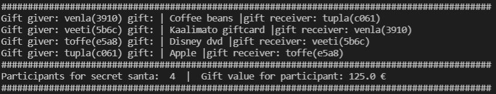

# Secret_Santa
School project from course "Basics of programming". Simple Python program to be executed in terminal.  

# Secret santa project work.
## What is this program?

This program will organize Secret santa for inserted participants. Programm generates gift giver, gift and receiver randomly. In addition
input(budget) is calculated per participant.  

## Features

Programm ask for user input to add participants and total budget for secret santa. Gifts are already created in gifts.txt file and will be randomly chosen  
from there. Participants are class elements and class can be found from source.py.  
Loops and functions are used for calculating budget and generating the unique list of giver, gift and receiver.

## Instructions

1. "Participant name: " Write participant name. Example: Onni  
2. "Do you want to add more participants? (yes/no): " Write 'yes' or use enter for inserting more names and write 'no' for proceeding in program.  
3. "Insert your company budget: " Insert budget as integer value. Example: 423  
4.  Program will now print results of secret santa.  
  

## Author  

### This project is designed and created by Veeti Hakala for course basics of programming.  
